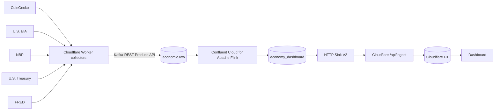

# Architecture

## Demo objective

Show why a streaming platform is useful even when upstream systems run at very different speeds.

```text
5 minutes    CoinGecko
hourly       U.S. EIA
daily        NBP
daily        U.S. Treasury
weekly       FRED
```

The demo normalizes them into one event contract and lets Confluent become the system that ties all temporal scales together.

## Default architecture



## Why Cloudflare in front of Kafka?

Not because Confluent cannot collect HTTP data. It can.

The default Worker collector exists for three practical demo reasons:

1. All APIs are normalized to the same contract before Kafka.
2. Secrets and provider quirks stay in one tiny serverless component.
3. The demo is easy to reproduce without building five source-specific Flink schemas.

Once the first demo works, move EIA/NBP/Treasury/FRED to HTTP Source V2 one at a time. That becomes a second demo: replacing custom ingestion code with managed connectors.

## Dashboard read model

The browser does not consume Kafka directly.

The `economy_dashboard` stream is pushed by HTTP Sink V2 to the Worker, which upserts by `metric` into D1. This gives the web page O(1)-style reads of the latest state and no Kafka credentials in JavaScript.

## What Flink contributes

The first SQL job makes a schemaless external-ingestion topic schemaful.

Good next extensions:

- 5-minute rolling crypto averages
- electricity-demand deviation versus prior hour/day
- FX conversions, e.g. BTC/USD × USD/PLN = BTC/PLN
- daily/weekly deltas
- anomaly or threshold events
- a single "economic pulse" score
